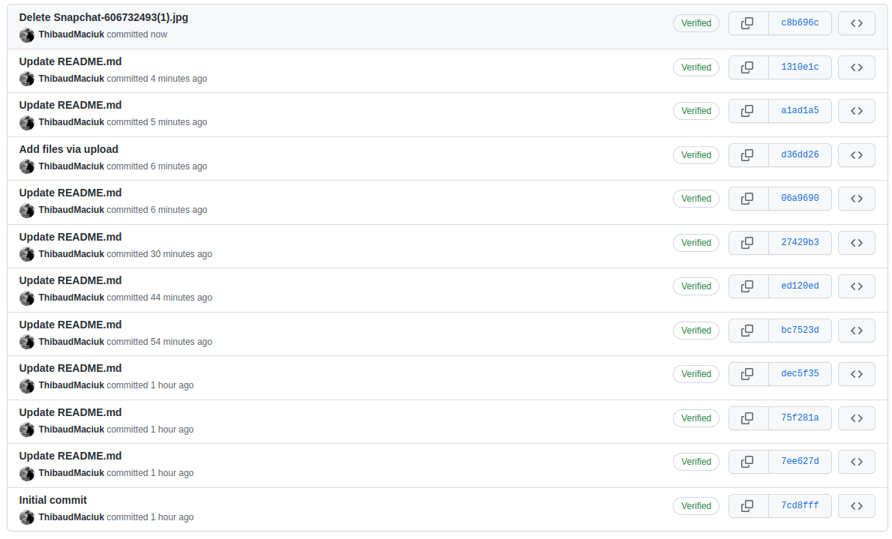
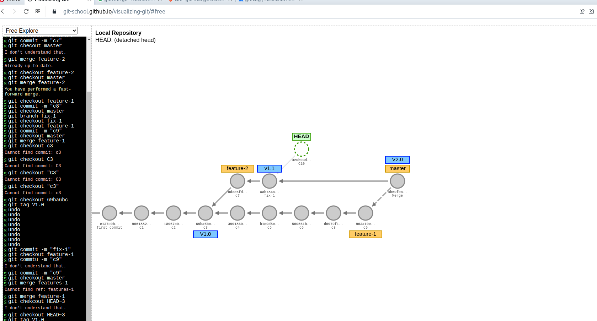
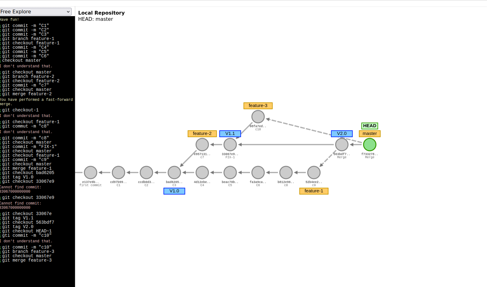
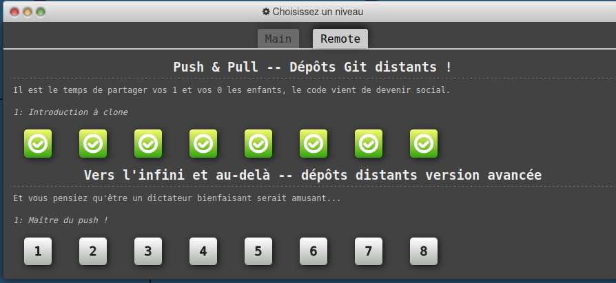
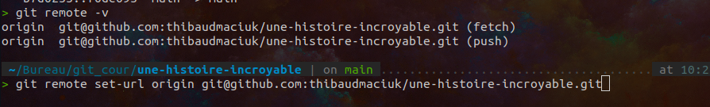

# memo-git

# Commande apprise:

git checkout = positionnez le HEAD sur une branche specifique

	exemple : git checkout MAIN

git revert = annulez les modification d'une branche distante

	exemple : git revert MAIN

git reset = annulez les modification d'une branche locale

	exemple : git reset HEAD~1

git rebase = permet de rejoindre tout les commit d'une branche vers la fin de la branche cible

	exemple : git rebase BRANCHE_A_COMPLETEZ BANCHE_A_AJOUTER

git checkout HEAD^ = revenir au commit precedent

git checkout HEAD~2 = revenir 2 commit en arriere

git merge =  faire rejoindre les commit de la branche actuelle vers une branche cible

	exemple : git merge MAIN

git branch -d : supprimer une branche

	exemple : git branch -d Feature

git branch = Creer une nouvelle branche

	exemple : git branch update

git checkout -b = creer une branche et y pointer le HEAD

	exemple : git checkout -b update
	
git status = voir les fichier modifiez qui doivent etre mis dans la stagging zone

	exemple : git status
	
git add = ajoutez dans fichier dans la stagging zone

	exemple : git add index.html

git commit = prendre un instantannée des modification apporté

	exemple : git commit -m "Header reglé"

git push = envoyer sont commit sur le repos distant

	exemple : git push

# 1.6 — Création de votre carte de visite sur Github

# Workflow

-Partie 3

Cette situation n'ets pas souhaitable car on as un commit hors des branche qui ne peut pas etre merger sur une branche
Pour resoudre cela on peut soit creer une nouvelle branche, soit supprimez le commit hos branche 

-FIN

# PARTIE 1.7

# PARTIE 1.8

conflit git:
	Un conflit git c'est quand deux changement su run meme fichier au meme endroit ont etait fait, cela creer un conflit.
	Pour le regler il faut manuellement re-agencer les changement dans le fichier afin de gerer ce conflit
	
	
# PARTIE 1.9

Authentification SSH:
	afin de setup une authentification ssh, il faut d'abord genere une cle sur notre machine, ensuite la config dans notre repos distant(github pour ma part) et chager le type de remote de notre gti local (avec git remote set-url)

# PARTIE 1.9

repos : https://github.com/ThibaudMaciuk/git-cda-2023-sample

	Fork = copier un repo est le maintenir automatiquement a jour comparer au repos parent.
	Une issue : creation d'une issue afin de signaler un probleme ou un beug
	commentaire de commit #issue :  permet de lier un commit a une issue
# PARTIE 2.3

	.Gitignore sert a lister les fichir a ignorer lors des manipulation du repos
# PARTIE 3.1

	Stash permet de faire une sauvegarde de l'instant sans focement de faire de commit afin de pouvoir se deplacer sur une autre branche par exemple et de finir les modifications plus tard
